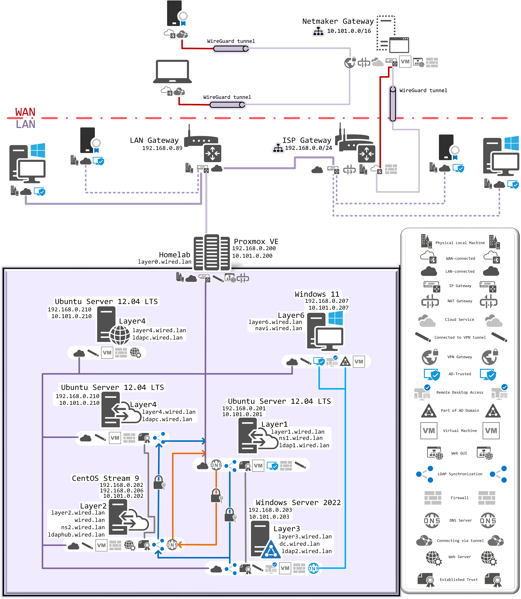

My little Homelab side project working on an old Legion laptop equipped with Proxmox Virtual Environment for practicing System and Network Administration.

Things already done:
- Authoritative DNS Server with local TLD and SLD with records for all hosts and VMs on the network with local DNSSEC implementation
- Slave + Recursive DNS Server for local domain resolving and caching remote domain records
- Windows Server 2022 installation with Active Directory and Samba share (it's great how it can be accessed from Android devices too - makes file transfer so much easier)
- Windows 11 Enterprise domain-connected installation with multi-session RDP accessible from within the LAN using AD credentials
- Two small web servers, one for SLD domain and second for a blog subdomain

Things WIP:
- LDAP Multi-Supplier, HUB and Consumer environment with 389-DS and AD synchronization (Still reading through that RHEL DS documentation - great knowledge base btw.)
	* AD synchronization done

Things To-Do:
- SSSD authentication via LDAP on every host
- Cloud OpenVPN server for host-to-site connections
- Mail Server
- Centralized Log Server

